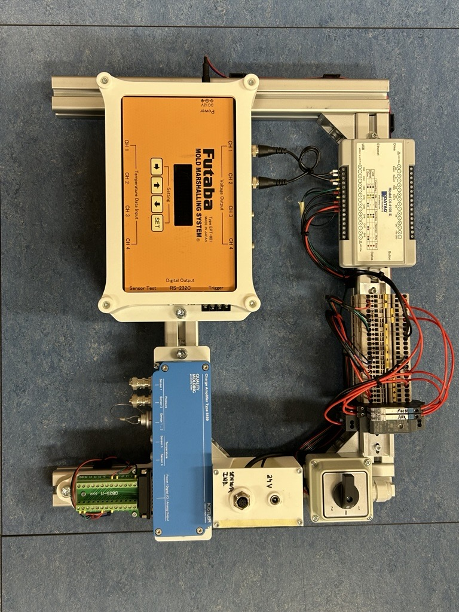
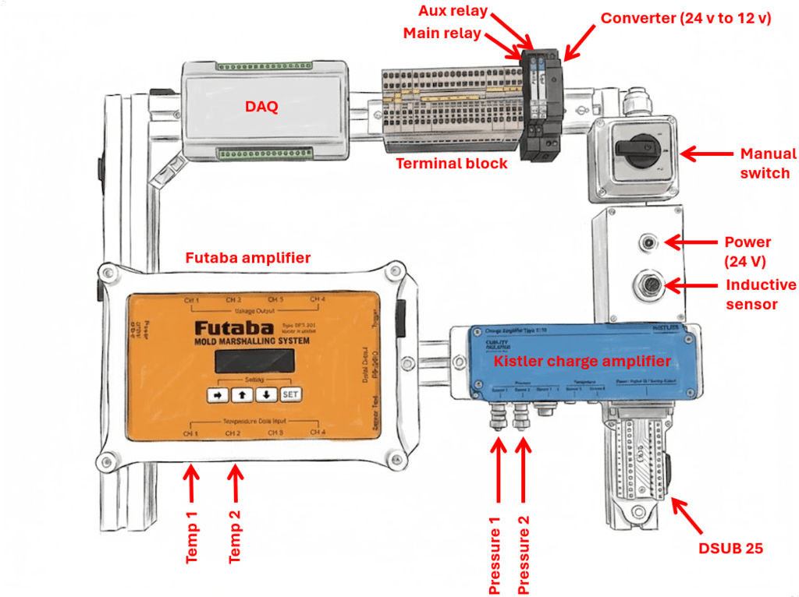
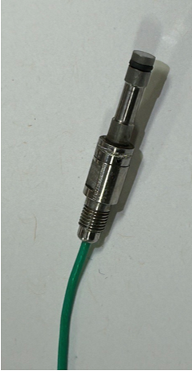
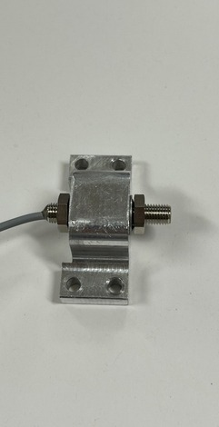
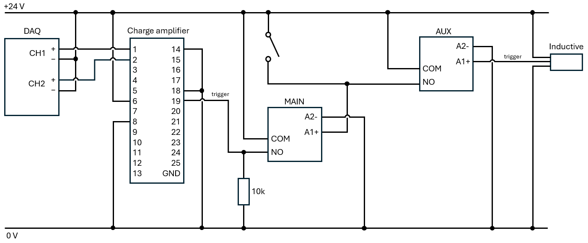
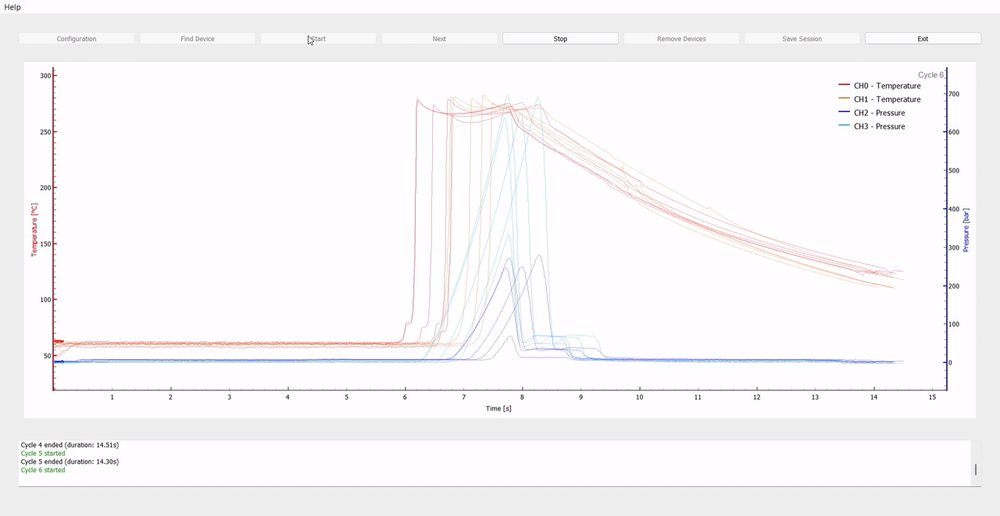
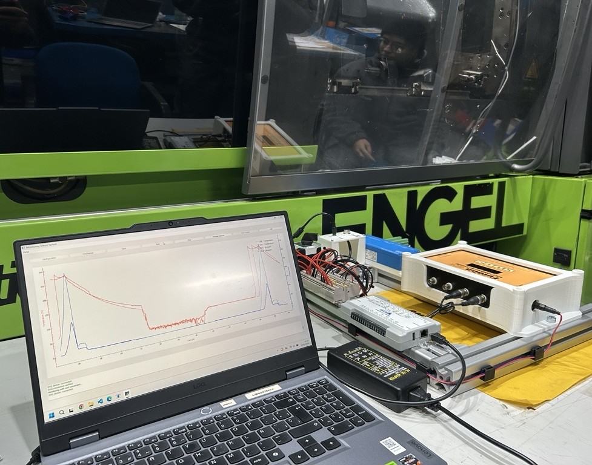

# `monitoring-injection-molding`
Integration of temperature and pressure sensors inside the cavity of an injection mold with real-time monitoring. Automatic cycle detection via an inductive proximity sensor.

# Hardware

## 1. Sensors:

| Kistler Piezoelectric (0–2000 bar) | Futaba IR (60–430 ºC) | Inductive Proximity | 
|:----------:|:---------:|:---------:|
|  |  |  |

**Why piezoelectric over piezoresistive?**
Injection molding involves rapid pressure spikes during filling. Piezoelectric sensors excel at capturing these fast, dynamic events with high linearity and are robust under high pressures and temperatures. However, they require charge amplifiers and are unsuitable for long-term static measurements due to drift.

**Why IR over thermocouple?**
IR sensors offer non-contact, fast-response measurement (<8ms) of melt temperature, unaffected by mold conduction. Thermocouples, though cost-effective, can have their melt temperature readings altered by heat conduction from the surrounding mold steel.

## 2. Circuit

**Reset Signal**
A 24 V reset signal is applied to the charge amplifier to discharge its internal capacitance and eliminate drift. This signal can be triggered by either a manual switch or the inductive proximity sensor (both work independently and can be active simultaneously).

**Relay Logic**
- Auxiliary relay: converts the sensor's electronic output into a mechanical contact, protecting the sensor electronics from the manual switch's direct 24 V supply.
- Main relay: energizes when either the manual switch or the auxiliary relay contact closes (wired in parallel). The main relay output controls the load, in this case, the charge amplifier's trigger/reset input (pin 19).

**Pull-Down Resistor (10 kΩ)**
A 10 kΩ pull-down resistor between the main relay's NO contact and ground ensures the trigger pin stays at a defined LOW state (0 V) when the relay is open, preventing false triggering from electrical noise.

# Software

