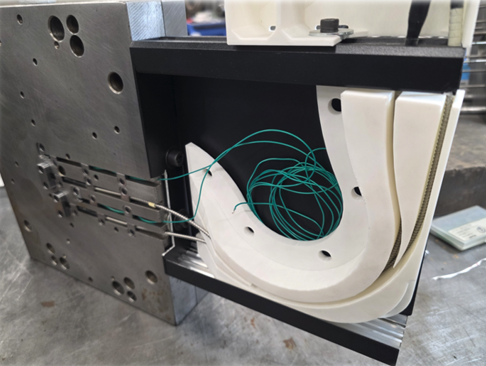
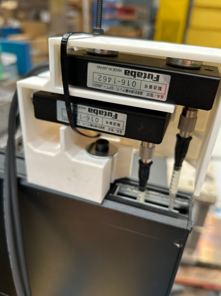
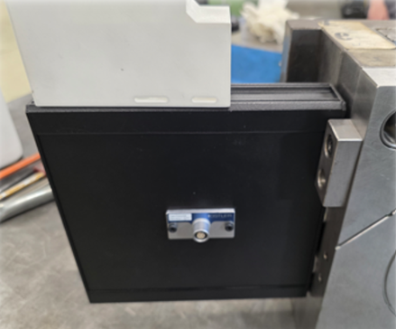
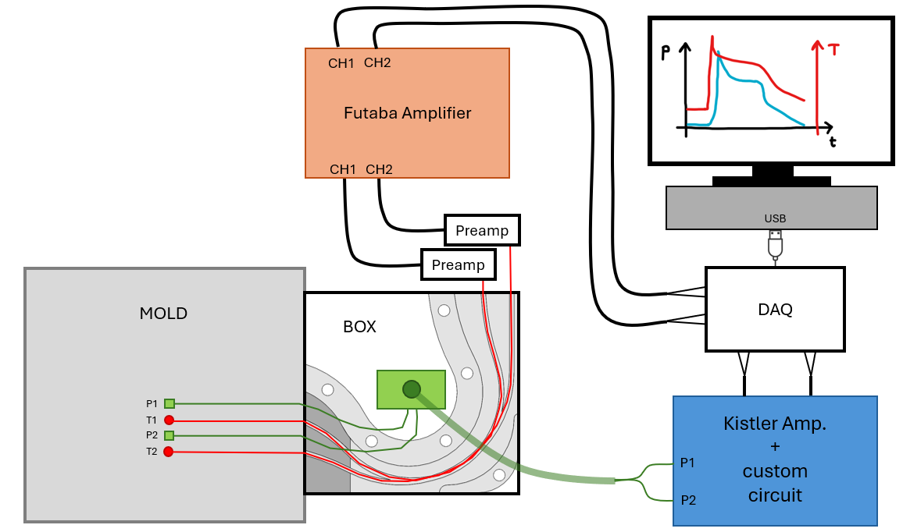

# `monitoring-injection-molding`
Integration of temperature and pressure sensors inside the cavity of an injection mold and real time monitoring of their readings and automatic cycle start finish ...

Used sensors:

- Kistler piezoelectric pressure sensors (0 ... 2000 bar)
- Kistler thermocouple temperature sensor (0 ... 200 ºC)
- Futaba IR temperature sensor (60 ... 430 ºC)

| Kistler piezoelectric | Kistler thermocouple | Futaba IR |
|:----------:|:---------:|:---------:|
|  |  |  |

# Hardware
The piezoelectric 

# Software

The positions of the sensors in the cavity is shown in the image below:

The Futaba IR wire, which connects the sensor tip to the preamplifier, is very rigid and cannot bend beyond a 50 mm radius of curvature. Due to this limitation, a box had to be installed outside the mold to route the wire toward some designated tracks.

| Assembly |
|:------------:|
| Inside box: Futaba wire tracks |
|  | 
| Temperature output and preamplifier location |
|  | 
| Pressure output |
|  | 

Since the Futaba amplifier outputs analog signals for temperature readings, we also require a Kistler amplifier that provides analog outputs for pressure measurements. In addition, a DAQ system is needed to synchronize both signals. The system must include software capable of displaying and saving the data in real time. A custom circuit is also required to trigger or reset the Kistler amplifier, either manually or automatically at the start of each new cycle.

The schematic that implements this is shown below:

And the custom circuit is ...

