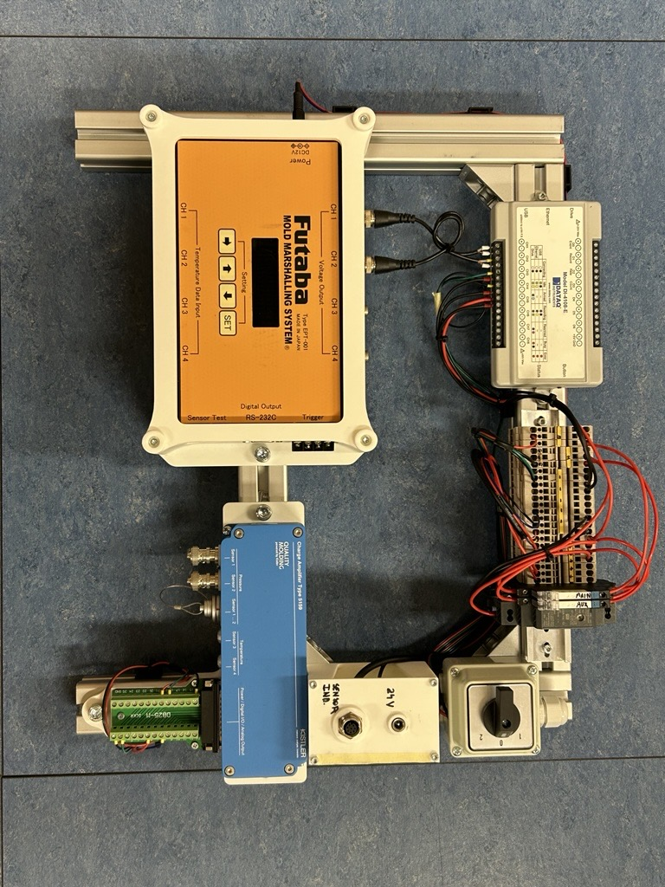
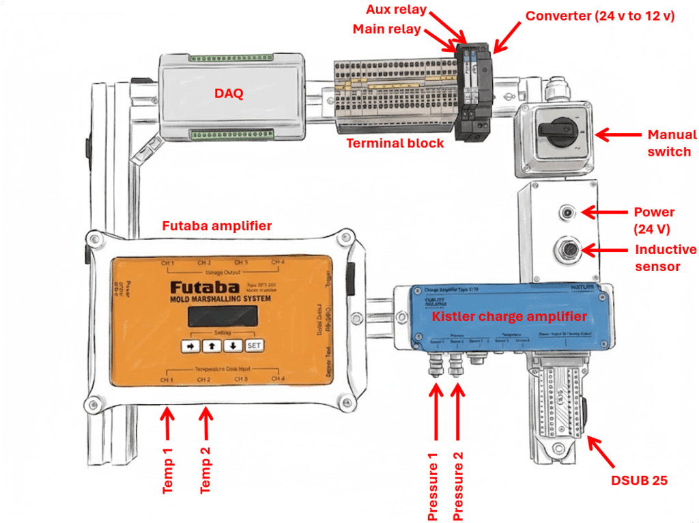
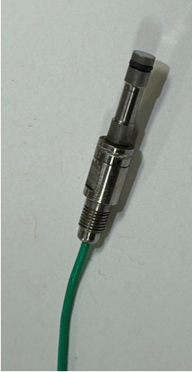
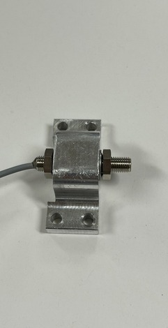
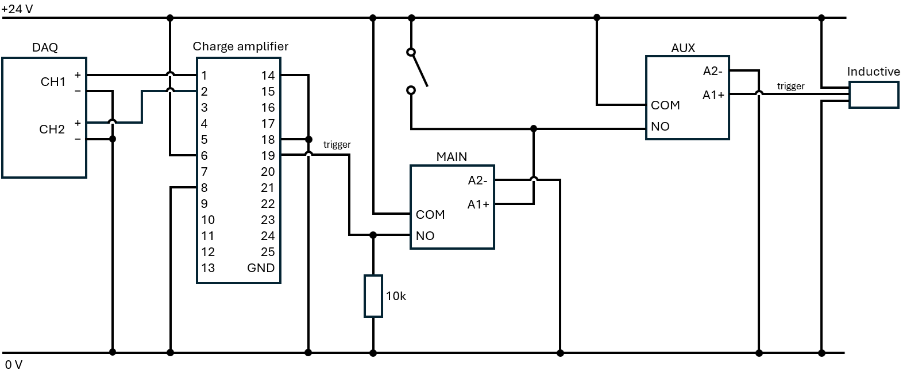
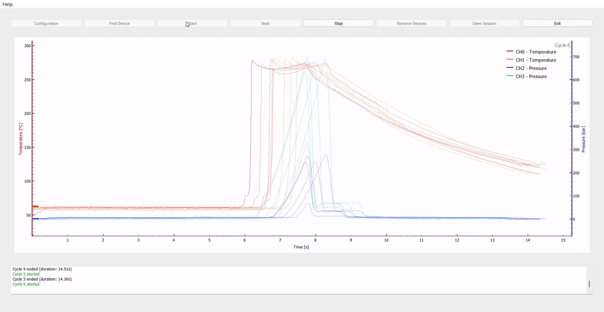
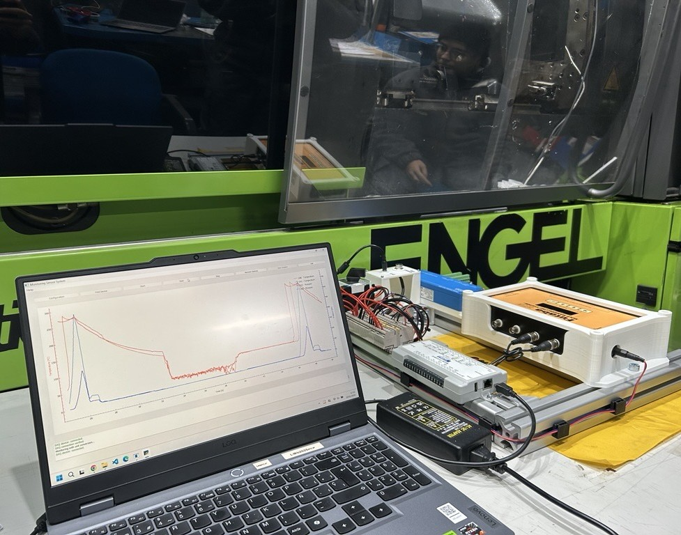

# `monitoring-injection-molding`
Integration of temperature and pressure sensors inside the cavity of an injection mold with real-time monitoring. Automatic cycle detection via an inductive proximity sensor.

# Hardware

UPDATE photos: added new connector for machine outputs and rewired 






## 1. Sensors:

| Kistler Piezoelectric (0–2000 bar) | Futaba IR (60–430 ºC) | Inductive Proximity | 
|:----------:|:---------:|:---------:|
|  |  |  |


**Why piezoelectric over piezoresistive?**
Injection molding involves rapid pressure spikes during filling. Piezoelectric sensors excel at capturing these fast, dynamic events with high linearity and are robust under high pressures and temperatures. However, they require charge amplifiers and are unsuitable for long-term static measurements due to drift.


**Why IR over thermocouple?**
IR sensors offer non-contact, fast-response measurement (<8ms) of melt temperature, unaffected by mold conduction. Thermocouples, though cost-effective, can have their melt temperature readings altered by heat conduction from the surrounding mold steel.


## 2. Circuit

UPDATE: aux relay is two poles and uses instead of GND and A1, COM 21 and NC 22 to go to D5

Talk about the dry contact that means, that thanks to the pull down (or up?) resistor inside the D5 ensures just a contact to GND (NC, incverted logic, contact to ground is mnot 0, but 1) con make the logic/read go to 1 in the D5





**Reset Signal**
A 24 V reset signal is applied to the charge amplifier to discharge its internal capacitance and eliminate drift. This signal can be triggered by either a manual switch or the inductive proximity sensor (both work independently and can be active simultaneously).

**Relay Logic**
- Auxiliary relay: converts the sensor's electronic output into a mechanical contact, protecting the sensor electronics from the manual switch's direct 24 V supply.
- Main relay: energizes when either the manual switch or the auxiliary relay contact closes (wired in parallel). The main relay output controls the load, in this case, the charge amplifier's trigger/reset input (pin 19).

**Pull-Down Resistor (10 kΩ)**
A 10 kΩ pull-down resistor between the main relay's NO contact and ground ensures the trigger pin stays at a defined LOW state (0 V) when the relay is open, preventing false triggering from electrical noise.


# Software






# IoT

ADD how data is send via mqtt to node red and send the data to server...
use the rpi repo readme for this!

### Grafana dashboard

The app publishes one `CH<n>_<sensor_type>` field per configured channel (already in
physical units) and the Node-RED flow ingests whatever channels arrive, so neither
needs edits when the channel setup changes. Only `grafana_dashboard.json` is static:
after changing `channels` / `channel_types` / `plot_channels` / `machine_id` in
`daq_config_defaults.json`, regenerate it and re-import it in Grafana
(Dashboards → Import; same uid, so the existing dashboard is updated in place):

```
py generate_grafana_dashboard.py
```